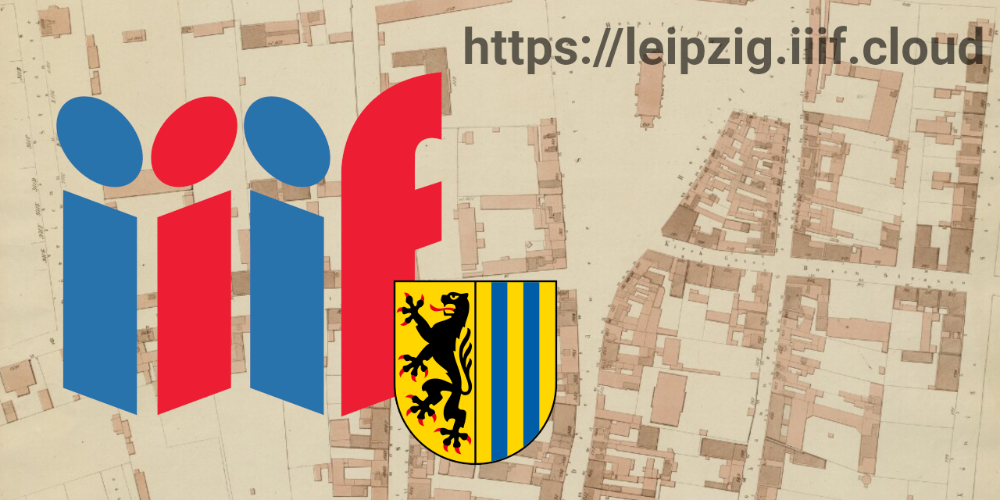
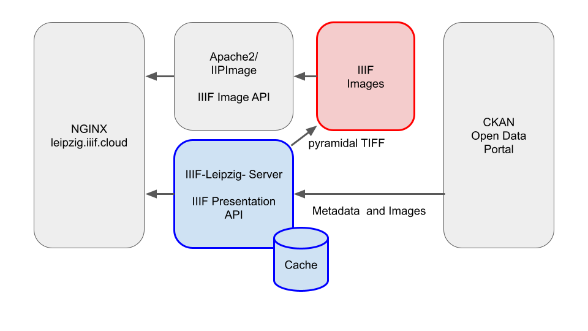

# IIIF for the Open-Data-Portal of the City of Leipzig

This is an external IIIF API service for the CKAN Open Data Portal of the City of Leipzig. It is my entry to the Open Data Hackathon 2023 of the City of Leipzig (https://2023.dataweek.de/lodh-2023/).

For more information on IIIF see https://iiif.io



Technical Features:
* Supports IIIF Presentation API version 2.1.1 and 3.0.0
* Supports IIIF Image API version 2 and 3 (via IIPImage Server)
* Cache with seamless demand driven metadata updates
* Lossless quality image conversion
* Asychronous/parallel architecture: high responsiveness even under high image conversion load
* Content Negotiation

Endless IIIF usage scenarios
* Digital Storytelling
* Cross-Institutional Research Workspaces
* Geo-Referencing of Maps and Photos
* Create Annotations
* Games and Fun-Apps
* Well prepared for AI and Machine-Learning
* and many more

Currently, as long as the service is not integrated into the appropriate websites, prior knowledge of the manifest URIs is required. See the file data/manifests.csv in order to get a list of the manifests.

## Usage examples

Here are three simple image loading examples to demonstrate the functionality. IIIF has of course much higher potential.

Load an image into Mirador:
https://manducus.net/m3/?manifest=https://leipzig.iiif.cloud/manifest/12feea1b-3edd-5308-8ae9-a41733bcc2ff

Load an image into Universalviewer:
https://uv-v4.netlify.app/#?manifest=https://leipzig.iiif.cloud/manifest/5539b4fc-d6fd-59ce-8f7f-5572931cee84&c=&m=&cv=&xywh=-213%2C317%2C3164%2C2566

Load an image into TIFY:
https://tify.rocks/?manifest=https%3A%2F%2Fleipzig.iiif.cloud%2Fmanifest%2Fd52bbf61-1995-4c41-a819-885fc4ea175a&xywh=-492%2C0%2C4314%2C2250

More complex usage scenarios are possible using storytelling apps (Storiiies, StrollView and others), research workspaces (Mirador 3 with annotation plugin) or edutainment apps (Animal Crossing Art Generator or Cover.Boutique). See https://github.com/IIIF/awesome-iiif for inspiration. And check out the poster in /img/ for some screenshots.

## System architecture

The main server is implemented in Javascript using Node, ExpressJS, Sqlite and other libraries. Image conversion is done using ImageMagick and uses pyramidal TIFF images with lossless JPEG compression.



The entire system runs on Linux or MacOSX and employs Apache2, Nginx, IIPImage and other components.

## Data Modelling

The current mapping is as follows

| CKAN | IIIF |
| ---- | ---- |
| dataset | manifest |
| resource | canvas / annotation page / image |

Important calls:

Get all (max. 1000) datasets with resource format "jpg":
https://opendata.leipzig.de/api/3/action/dataset_search?fq=res_format:jpg&rows=1000

Get a specific dataset:
https://opendata.leipzig.de/api/3/action/dataset_show?id=d52bbf61-1995-4c41-a819-885fc4ea175a

Get a resource (canvas/image level):
https://opendata.leipzig.de/api/3/action/resource_show?id=b28b38fa-85e5-4a8b-98a0-5230cd3f275c

### IIIF URI Schema

This is an intermediate URI schema that may or should be subject to change in the future.

#### Presentation API

Manifest:

```https://leipzig.iiif.cloud/manifest/<dataset.id>```

Canvas:

```https://leipzig.iiif.cloud/manifest/<dataset.id>/canvas/<resource.id>```

#### Image API

```https://leipzig.iiif.cloud/image/<resource.id>```

## Notes

ImageMagick required this in ```/etc/ImageMagick-6/policy.xml``` in order to process large images:
```
<policy domain="resource" name="disk" value="8GB"/>
```

## Installation

* check out this repository

* run ```npm install```

* copy ```src/config.example.json``` to ```src/config.json``` and edit all parameters

* run ```nodemon src/index.js```

* optional: edit and run ```node src/utils/warmup.js``` in order to do all the heavy image conversion upfront

(install Linux, Apache2, Nginx, IIPServer etc. according to their documentation)

## Further Development

In the near future the following things could be considered:

* Grouping the manifests into collections. Requires the help of subject experts.

* IIIF services could be integrated in their respective websites.

* The contents of the system could be extended.
